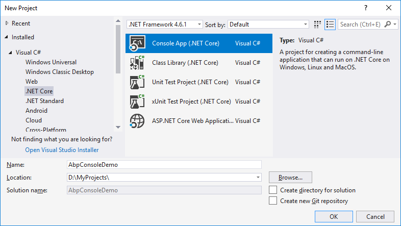

# Getting Started ABP With Console Application

This tutorial explains how to start ABP from scratch with minimal dependencies. You generally want to start with a **[startup template](https://abp.io/Templates)**.

## Create A New Project

Create a new Regular .Net Core Console Application from Visual Studio:



## Install Volo.Abp Package

Volo.Abp.Core is the core nuget package to create ABP based applications. So, install it to your project:

````
Install-Package Volo.Abp.Core
````

## Create First ABP Module

ABP is a modular framework and it requires a **startup (root) module** class derived from ``AbpModule``:

````C#
using Microsoft.Extensions.DependencyInjection;
using Volo.Abp.Modularity;

namespace AbpConsoleDemo
{
    public class AppModule : AbpModule
    {
        
    }
}
````

``AppModule`` is a good name for the startup module for an application.

## Initialize The Application

The next step is to bootstrap the application using the startup module created above:

````C#
using System;
using Volo.Abp;

namespace AbpConsoleDemo
{
    class Program
    {
        static void Main(string[] args)
        {
            using (var application = AbpApplicationFactory.Create<AppModule>())
            {
                application.Initialize();

                Console.WriteLine("Press ENTER to stop application...");
                Console.ReadLine();
            }
        }
    }
}

````

``AbpApplicationFactory`` is used to create the application and load all modules taking ``AppModule`` as the startup module. ``Initialize()`` method starts the application.

## Hello World!

The application above does nothing. Let's create a service that does something:

````C#
using System;
using Volo.Abp.DependencyInjection;

namespace AbpConsoleDemo
{
    public class HelloWorldService : ITransientDependency
    {
        public void SayHello()
        {
            Console.WriteLine("Hello World!");
        }
    }
}

````

``ITransientDependency`` is a special interface of ABP that automatically registers the service as transient (see [dependency injection document](Dependency-Injection.md)).

Now, we can resolve the ``HelloWorldService`` and say hello. Change the Program.cs as shown below:

````C#
using System;
using Microsoft.Extensions.DependencyInjection;
using Volo.Abp;

namespace AbpConsoleDemo
{
    class Program
    {
        static void Main(string[] args)
        {
            using (var application = AbpApplicationFactory.Create<AppModule>())
            {
                application.Initialize();

                //Resolve a service and use it
                var helloWorldService = 
                    application.ServiceProvider.GetService<HelloWorldService>();
                helloWorldService.SayHello();

                Console.WriteLine("Press ENTER to stop application...");
                Console.ReadLine();
            }
        }
    }
}
````

While it's enough for this simple code example, it's always suggested to create scopes in case of directly resolving dependencies from ``IServiceProvider`` (see the [Dependency Injection documentation](Dependency-Injection.md)).

## Using Autofac as the Dependency Injection Framework

While AspNet Core's Dependency Injection (DI) system is fine for basic requirements, Autofac provides advanced features like Property Injection and Method Interception which are required by ABP to perform advanced application framework features.

Replacing AspNet Core's DI system by Autofac and integrating to ABP is pretty easy.

1. Install [Volo.Abp.Autofac](https://www.nuget.org/packages/Volo.Abp.Autofac) package

```
Install-Package Volo.Abp.Autofac
```

1. Add ``AbpAutofacModule`` Dependency

```c#
[DependsOn(typeof(AbpAutofacModule))] //Add dependency to the AbpAutofacModule
public class AppModule : AbpModule
{
    
}
```

1. Change ``Program.cs`` file as shown below:

```c#
using System;
using Microsoft.Extensions.DependencyInjection;
using Volo.Abp;

namespace AbpConsoleDemo
{
    class Program
    {
        static void Main(string[] args)
        {
            using (var application = AbpApplicationFactory.Create<AppModule>(options =>
            {
                options.UseAutofac(); //Autofac integration
            }))
            {
                application.Initialize();

                //Resolve a service and use it
                var helloWorldService = 
                    application.ServiceProvider.GetService<HelloWorldService>();
                helloWorldService.SayHello();

                Console.WriteLine("Press ENTER to stop application...");
                Console.ReadLine();
            }
        }
    }
}
```

Just called `options.UseAutofac()` method in the `AbpApplicationFactory.Create` options.

## Source Code

Get source code of the sample project created in this tutorial from [here](https://github.com/abpframework/abp/tree/master/samples/BasicConsoleApplication).
